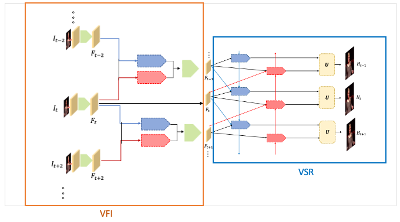

# SELF_STVSR (VSR + VFI)

This is the Pytorch implementation of STVSR algorithm using optical flow.

## Introduction
STVSR algorithm using optical flow. The figure below is the structure of the whole model.



## Prerequisites

- Python 3 (Recommend to use [Anaconda](https://www.anaconda.com/download/#linux))
- [PyTorch >= 1.1](https://pytorch.org/)
- NVIDIA GPU + [CUDA](https://developer.nvidia.com/cuda-downloads)
- Python packages: `pip install numpy opencv-python lmdb pyyaml pickle5 matplotlib seaborn`

## Get Started

### Installation

Install the required packages: `pip install -r requirements.txt`

### Testing

We provide the test code for both standard test sets (Vid4) and custom video frames.

#### Pretrained Models

Our pretrained model will be ready soon.


#### From Extracted Frames

You can test the model with the following commands:

```Shell
cd $ROOT/codes
python test.py
```

- You can put your own test folders in the [test_example](./test_example) too, or just change the input path, the number of frames, etc. in [test.py](codes/test.py).

- Your custom test results will be saved to a folder here: `$ZOOMING_ROOT/results/your_data_name/`.

#### Evaluate on Standard Test Sets

The [test.py](codes/test.py) script also provides modes for evaluation on the following test sets: `Vid4`, `SPMC`, etc. We evaluate PSNR and SSIM on the Y-channels in YCrCb color space. The commands are the same with the ones above. All you need to do is the change the data_mode and corresponding path of the standard test set.


## Acknowledgments

Our code is inspired by [TDAN-VSR](https://github.com/YapengTian/TDAN-VSR), [EDVR](https://github.com/xinntao/EDVR), [BasicVSR](https://github.com/ckkelvinchan/BasicVSR-IconVSR) and [Zooming Slow-Mo](https://github.com/Mukosame/Zooming-Slow-Mo-CVPR-2020).
